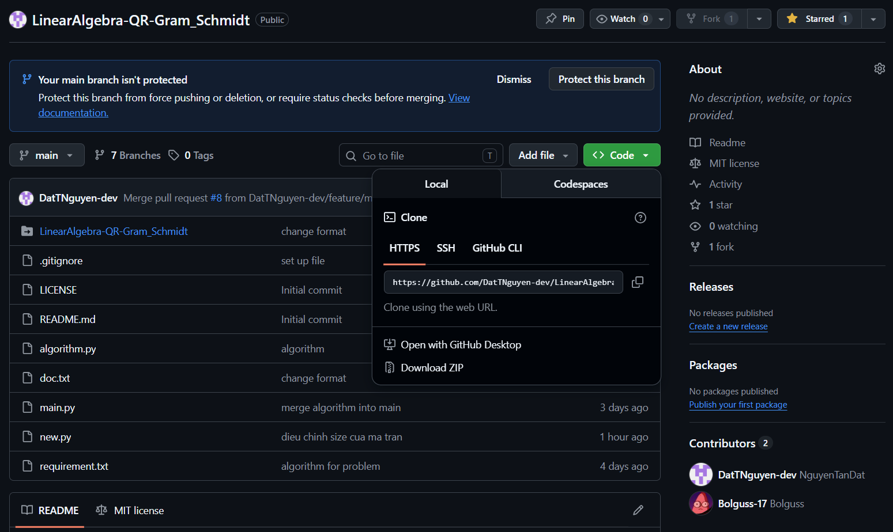
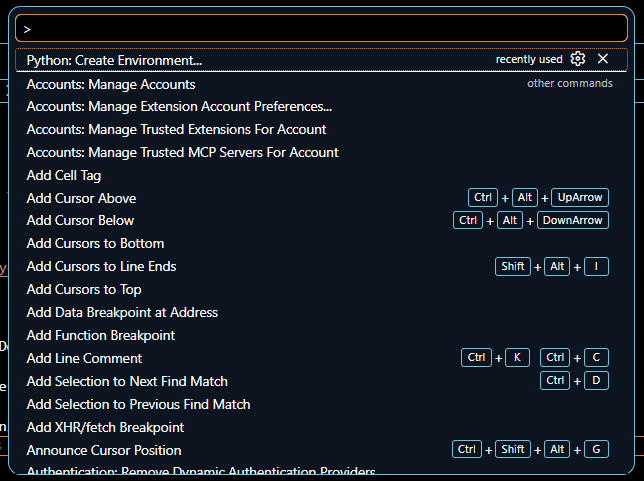

# LinearAlgebra-QR-Gram_Schmidt

## How to use this project
Step 1. Clone the repository to your local machine.
Use this command in your terminal:
**Method 1:**
```bash cd ~
git clone https://github.com/DatTNguyen-dev/LinearAlgebra-QR-Gram_Schmidt.git
```
Method 2:

Click the "Code" button and select "Download ZIP". Then, extract the downloaded ZIP file to your desired location.

Step 2. Open the project in your code editor

Step 3. Set up the environment and install libraries

Choose "Python: Create Environment" and select "Venv". Then, select the Python version you want to use. After that, click on the "Install" button to install the required libraries.
Libraries used in this project include:
- Numpy.
- pyqt5
- qt5-applications
- qtwidgets
- PyQt5-stubs

Step 4. Run the project
'''bash python main.py'''